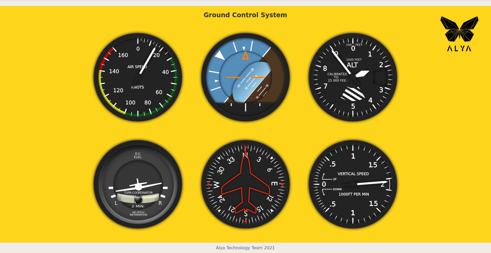

# flight-gcs
A developed version of a web based ground control station for UAV  
Ajax added for Update all data without reloading the page from a text file

The "data.json" file can be edited for any immediate changes.

Just upload your server and edit the "data.js" file :) 

</img>
